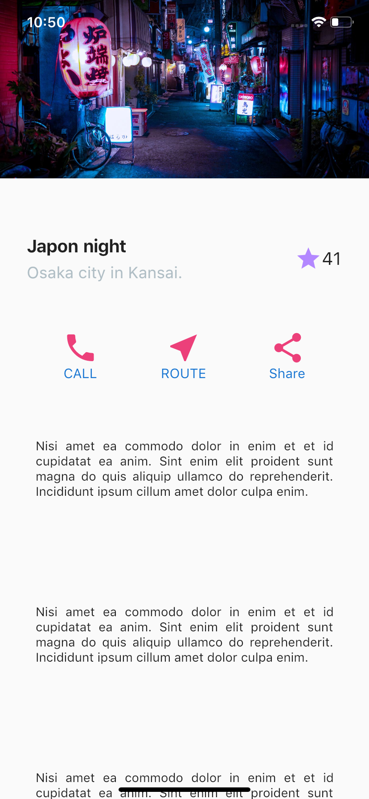
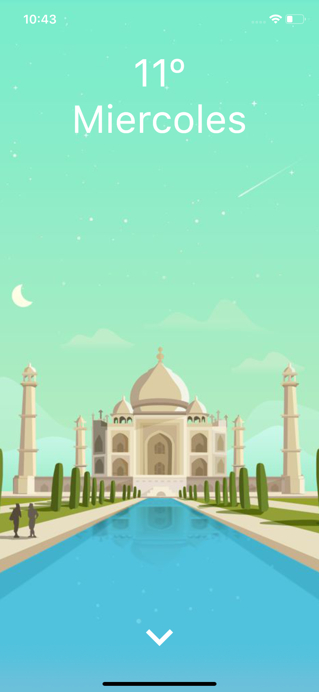
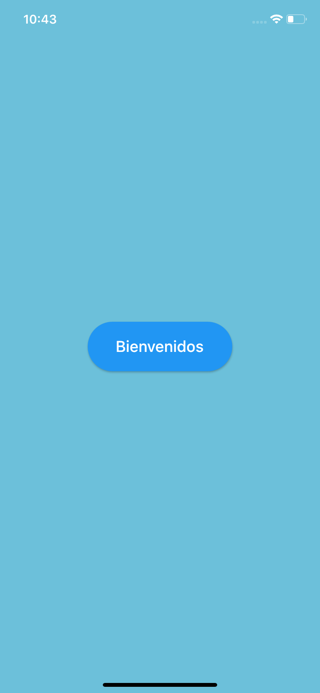
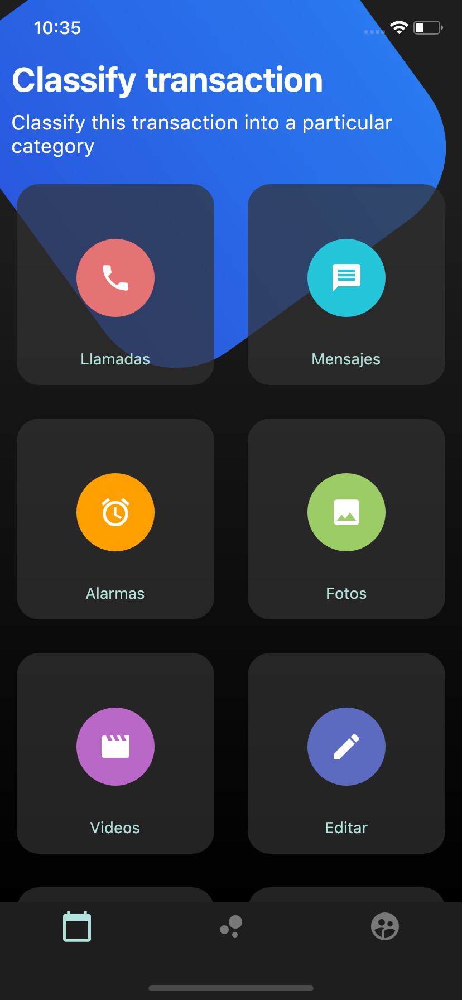
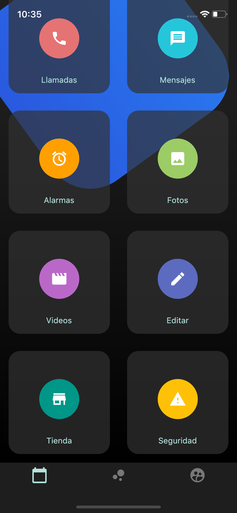

# Flutter_Designs
Mocs for apps.
3 Screens for saving time in mobile develoment.

# Requerimientos 

Instalar Xcode, Visual Studio Core y Simulator para IOS.
Para Visual Studio instalar siguientes plugins:
* Dart(Version usada en este proyecto 3.5.1).
* Flutter(Version usada en este proyecto 3.5.1).
* Awesome Flutter Snippet(Version usada en este proyecto 2.0.2).
* Bracket Pair Colorizer 2(Version usada en este proyecto 0.0.28).

# Compilación

Importar el proyecto a Visual Studio y tener un dispositivo móvil/simulador para probarlo. 

# Código 

Todo esta en la carpeta "lib", los complementos estan en las otras.

## Autores 

* **Ferrer Garcia Erick** - [ErickFerrer96](https://github.com/ErickFerrer96)

## Documentacion de Flutter usada en este proyecto

* [Documentación de flutter](https://flutter.dev/docs)

## Galeria

Todas las screenshoots presentadas estan en la carpeta de Imagenes.

| Pantalla | Descripción | Imagenes |
| --- | --- | --- |
| 1 | Pantalla de descripcion de algún lugar/objeto |  |
| 2 | Pantalla de inicio con fecha | |
| 3 | Pantalla con boto seguimiento de la anterior |  |
| 4 | Pantalla de menú |  |
| 5 | Pantalla de menú |  |
